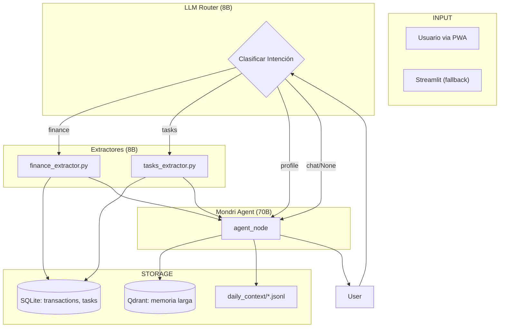
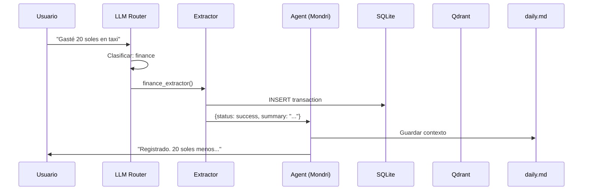

# Moon AI - Guia Tecnica v3.3

> **Ultima actualizacion:** 2026-01-31  
> **Estado:** Produccion-ready (refactorizado)  
> **Autor del documento:** Generado por Antigravity AI

---

## 📋 Índice Rápido

1. [¿Qué es Moon AI?](#qué-es-moon-ai)
2. [Arquitectura General](#arquitectura-general)
3. [Stack Tecnológico](#stack-tecnológico)
4. [Flujos de Ejecución](#flujos-de-ejecución)
5. [Estructura de Archivos](#estructura-de-archivos)
6. [Sistema de Memoria](#sistema-de-memoria)
7. [Modelos y Latencia](#modelos-y-latencia)
8. [Cómo Correr el Proyecto](#cómo-correr-el-proyecto)
9. [Próximos Pasos](#próximos-pasos)
10. [Troubleshooting](#troubleshooting)

---

## ¿Qué es Moon AI?

Moon AI es un asistente personal con personalidad "Mondri" (sarcástica pero útil) que:

- **Registra gastos** automáticamente en SQLite
- **Crea recordatorios/tareas** con fechas
- **Recuerda datos personales** usando Qdrant (memoria larga) + daily.md (memoria corta)
- **Conversa** con contexto de conversaciones previas

---

## Arquitectura General



---

## Stack Tecnológico

| Componente | Tecnología | Propósito |
|------------|------------|-----------|
| **Framework** | LangGraph | Orquestación de flujos |
| **LLM Provider** | Groq | API de inferencia (gratis) |
| **Modelos** | Llama 3.1-8B, Llama 3.3-70B | Extracción y conversación |
| **Structured Output** | Instructor + Pydantic | Extracción con schema |
| **Base de Datos** | SQLite | Transacciones, tareas, notas |
| **Vector Store** | Qdrant (local) | Memoria semántica larga |
| **Memoria Wrapper** | Mem0 | Abstracción sobre Qdrant |
| **UI** | Streamlit | Interfaz de chat |
| **Embeddings** | FastEmbed | Embeddings locales |
| **Frontend** | SvelteKit PWA | Interfaz móvil |
| **API** | FastAPI | REST + SSE streaming |

### Dependencias Clave

```bash
langchain-groq      # LLM via Groq
langgraph           # Orquestación
instructor          # Structured outputs
qdrant-client       # Vector DB
mem0ai              # Memory abstraction
streamlit           # UI
pydantic            # Data validation
```

---

## Flujos de Ejecución

### Flujo Completo



### Tipos de Flujo

| Intención | Extractor | DB | Memoria Qdrant | Latencia |
|-----------|-----------|-----|----------------|----------|
| `finance` | ✅ 8B | SQLite | ❌ Skip | ~1.5s |
| `tasks` | ✅ 8B | SQLite | ❌ Skip | ~1.5s |
| `profile` | ❌ | — | ✅ Escribe | ~2s |
| `chat/None` | ❌ | — | 🔍 Lee si necesario | ~2s |

---

## Estructura de Archivos

```
Moon/
├── api/                         # 🌐 API Backend (FastAPI)
│   ├── main.py                  # FastAPI app entry
│   └── routes/
│       ├── chat.py              # /api/chat, /api/chat/stream (SSE)
│       └── health.py            # /api/health
│
├── frontend/                    # 📱 PWA Frontend (SvelteKit)
│   ├── src/
│   │   ├── lib/components/chat/ # ChatContainer, MessageBubble, InputBar
│   │   ├── lib/api/client.ts    # SSE streaming client
│   │   ├── lib/stores/          # Svelte 5 runes stores
│   │   └── routes/+page.svelte  # Main chat page
│   ├── static/                  # PWA icons
│   └── vite.config.ts           # PWA + Tailwind config
│
├── src/
│   ├── core/                    # 🧠 Núcleo del sistema
│   │   ├── graph.py             # LangGraph - flujo principal
│   │   ├── nodes.py             # Nodos: router_node, agent_node
│   │   ├── llm_router.py        # Router basado en LLM
│   │   ├── llm_client.py        # Factory de modelos Groq
│   │   ├── memory.py            # Wrapper Mem0/Qdrant
│   │   ├── prompts.py           # Identidad de Mondri
│   │   ├── database.py          # Modelos SQLAlchemy
│   │   └── state.py             # AgentState definition
│   │
│   ├── skills/                  # 🛠️ Habilidades/extractores
│   │   ├── finance_extractor.py # Extrae gastos → SQLite
│   │   ├── tasks_extractor.py   # Extrae tareas → SQLite
│   │   ├── daily_context.py     # Memoria corta (jsonl)
│   │   ├── memory.py            # Tools: save_thought, save_todo
│   │   └── profile.py           # Tools: update_profile
│   │
│   └── models/                  # 📦 Schemas Pydantic
│       ├── finance.py           # Transaction schema
│       ├── knowledge.py         # NoteEntry, TaskEntry
│       └── profile.py           # UserProfileEntry
│
├── tools/                       # Scripts de desarrollo
│   ├── run_dev.py               # 🚀 Levanta API + Frontend
│   ├── load_aliases.sh          # Aliases: on, dev, run, db, etc.
│   ├── reset_memory.py          # Reset Qdrant
│   └── check_db.py              # Verificar SQLite
│
├── finance.db                   # Base de datos SQLite
├── MOON_AI_GUIDE.md             # Este documento
└── MOON_FRONTEND_GUIDE.md       # Guía del frontend PWA
```

### Archivos Clave para Modificar

| Si quieres... | Modifica... |
|---------------|-------------|
| Cambiar personalidad de Mondri | `src/core/prompts.py` |
| Ajustar clasificación de intenciones | `src/core/llm_router.py` |
| Modificar extracción de gastos | `src/skills/finance_extractor.py` |
| Modificar extracción de tareas | `src/skills/tasks_extractor.py` |
| Cambiar flujo del grafo | `src/core/graph.py` + `nodes.py` |
| Ajustar memoria corta | `src/skills/daily_context.py` |
| Cambiar modelos LLM | `src/core/llm_client.py` |

---

## Sistema de Memoria

### Arquitectura de Memoria (3 Capas)

```
┌─────────────────────────────────────────────────┐
│  CAPA 1: Memoria Inmediata (daily_context)      │
│  ├─ Archivo: daily_context/YYYY-MM-DD.jsonl     │
│  ├─ Retención: 7 días                           │
│  ├─ Uso: Contexto conversacional del día        │
│  └─ Latencia: ~5ms (lectura local)              │
├─────────────────────────────────────────────────┤
│  CAPA 2: Memoria Larga (Qdrant via Mem0)        │
│  ├─ Collection: moon_hippocampus                │
│  ├─ Retención: Permanente                       │
│  ├─ Contenido: Hechos, preferencias, relaciones │
│  └─ Latencia: ~200-500ms                        │
├─────────────────────────────────────────────────┤
│  CAPA 3: Datos Estructurados (SQLite)           │
│  ├─ Tablas: transactions, tasks, notes          │
│  ├─ Retención: Permanente                       │
│  └─ Uso: Consultas específicas (no RAG)         │
└─────────────────────────────────────────────────┘
```

### Cuándo se Escribe en Qdrant

La funcion `_should_save_to_longterm()` en `nodes.py` detecta patrones permanentes:

```python
# Patrones que activan guardado en Qdrant
- "me llamo X"              # nombre
- "soy de/un X"             # identidad
- "me gusta/encanta X"      # preferencias
- "mi madre/padre es"       # relaciones
- "soy vegetariano"         # restricciones
- "estoy aprendiendo X"     # habilidades (NUEVO)
- "me esta gustando X"      # intereses (NUEVO)
- "ahora uso/trabajo con X" # herramientas (NUEVO)
```

---

## Modelos y Latencia

### Distribución de Modelos

| Componente | Modelo | Latencia | Tokens/req |
|------------|--------|----------|-----------|
| LLM Router | llama-3.1-8b-instant | ~300ms | ~100 |
| Finance Extractor | llama-3.1-8b-instant | ~500ms | ~200 |
| Tasks Extractor | llama-3.1-8b-instant | ~500ms | ~150 |
| Agent (Mondri) | llama-3.3-70b-versatile | ~1-1.5s | ~500 |

### Latencia Típica por Flujo

| Flujo | Total | Desglose |
|-------|-------|----------|
| Finance | ~1.8s | Router(300ms) + Extractor(500ms) + Agent(1s) |
| Tasks | ~1.8s | Router(300ms) + Extractor(500ms) + Agent(1s) |
| Chat | ~1.5s | Router(300ms) + Agent(1.2s) |
| Chat+Qdrant | ~2s | Router(300ms) + Qdrant(400ms) + Agent(1.3s) |

---

## Cómo Correr el Proyecto

### Requisitos

```bash
# Python 3.11+
# Variables de entorno en .env:
GROQ_API_KEY=gsk_xxx
```

### Comandos

```bash
# Activar entorno (con alias configurados)
on

# Correr API + Frontend juntos (RECOMENDADO)
dev       # Levanta FastAPI :8000 + SvelteKit :5173
dev api   # Solo backend
dev web   # Solo frontend

# Correr Streamlit (fallback)
run       # alias para: streamlit run app.py

# Ver base de datos
db        # abre Outerbase o sqlite3

# Tests rápidos
python test_fixes.py
python test_router.py
```

### Probar en iPhone

1. `on && dev` en tu Mac
2. Abre la URL de "Network" en Safari (ej: `http://192.168.1.2:5173`)
3. Share → Add to Home Screen

### Verificar que Todo Funciona

```bash
python -c "
from src.core.llm_router import classify_intent
from src.skills.finance_extractor import extract_and_save_expense

# Test router
print(classify_intent('Gasté 20 en taxi'))  # → finance

# Test extractor
print(extract_and_save_expense('Gasté 10 en agua'))  # → success
"
```

---

## Próximos Pasos

### Pendientes Inmediatos

- [ ] **Integrar Actual Budget** - Schema complejo, usar 70B
- [ ] **Worker nocturno** - Sintetizar daily.md → Qdrant
- [ ] **Dashboard de memoria** - Visualizar qué hay en Qdrant

### Mejoras Futuras

- [ ] **Multi-usuario** - Reemplazar "andy_dev" hardcodeado
- [ ] **Streaming** - Respuestas progresivas en Streamlit
- [ ] **Notifications** - Enviar recordatorios reales
- [ ] **Fine-tuning** - Router custom para español

### Deuda Tecnica

- [x] ~~`observer.py` - Codigo no usado~~ Eliminado
- [x] ~~`router.py` (semantic)~~ Eliminado (ahora solo `llm_router.py`)
- [x] ~~Schema `Transaction` duplicado~~ Consolidado en `models/finance.py`
- [x] ~~Emojis en logs~~ Estandarizado a `[DEBUG]`, `[ROUTER]`, etc.
- [x] ~~Comentarios obsoletos~~ Limpiados
- [x] ~~`src/tools/` redundante~~ Consolidado en `tools/`
- [ ] Tests formales - Migrar a pytest (actualmente en `tests/`)

---

## Troubleshooting

### "No se encontraron items" en Finance

**Causa:** El modelo 8B puede fallar con inputs ambiguos.  
**Solución:** El prompt actual es simple y funciona. Si falla, revisar `finance_extractor.py`.

### Cold Start Lento (5-6s primer mensaje)

**Causa:** Qdrant inicializa en primer uso.  
**Solución:** Normal, solo afecta primer mensaje de la sesión.

### Router Clasifica Mal

**Causa:** LLM router puede equivocarse en edge cases.  
**Solución:** Ajustar ejemplos en el prompt de `llm_router.py`.

### Error "Mem0 atexit after shutdown"

**Causa:** Cosmético, Mem0 intenta cleanup después de cerrar.  
**Solución:** Ignorar, no afecta funcionalidad.

---

## Decisiones de Diseño Clave

### ¿Por qué LLM Router en lugar de Semantic Router?

- Semantic-router requiere agregar ejemplos manualmente
- LLM generaliza mejor para español y variabilidad lingüística
- Trade-off: 300ms latencia vs infinitas horas agregando utterances

### ¿Por qué 8B para extractores y 70B para agente?

- 8B: Suficiente para extracción estructurada simple
- 70B: Necesario para conversación natural y contexto
- Si Actual Budget (schema complejo) → usar 70B para extractor

### ¿Por qué daily.md + Qdrant?

- daily.md: Rápido (~5ms), contexto inmediato
- Qdrant: Lento (~400ms), solo cuando se necesita historia
- Optimización: Skip Qdrant en finance/tasks (FAST PATH)

---

## Contacto y Recursos

- **Proyecto:** `/Users/macbookpro/Documents/projects-ai/Moon`
- **DB:** `finance.db` (SQLite)
- **Qdrant:** Local, collection `moon_hippocampus`
- **Logs:** Ver consola de Streamlit

---

*Este documento fue generado para facilitar el retorno al proyecto. Para contexto completo de las decisiones tomadas, revisar los archivos en `.gemini/antigravity/brain/` de esta conversación.*
