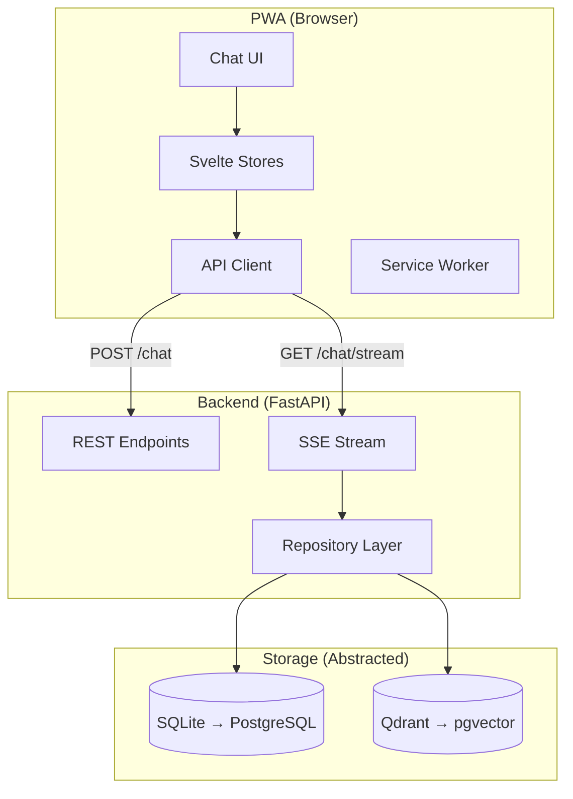
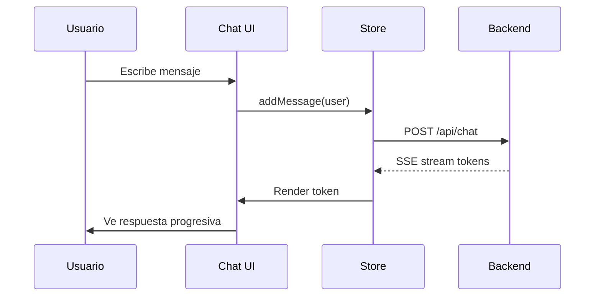

# Moon AI Frontend - Guía Técnica v1.0

> **Última actualización:** 2026-01-31  
> **Estado:** Base lista (Chat UI + PWA configurado)  
> **Tipo:** PWA (Progressive Web App)

---

## 📋 Índice Rápido

1. [¿Qué es el Frontend de Moon?](#qué-es-el-frontend-de-moon)
2. [Stack Tecnológico](#stack-tecnológico)
3. [Arquitectura](#arquitectura)
4. [Estructura de Archivos](#estructura-de-archivos)
5. [Comunicación con Backend](#comunicación-con-backend)
6. [PWA Features](#pwa-features)
7. [Cómo Correr el Proyecto](#cómo-correr-el-proyecto)

---

## ¿Qué es el Frontend de Moon?

PWA que reemplaza Streamlit con experiencia tipo app nativa:

- **Chat interface** minimalista estilo Grok
- **Streaming** de respuestas LLM (token por token)
- **Voice recording** para mensajes de voz
- **Camera/file upload** para imágenes y adjuntos
- **Push notifications** (iOS 16.4+ / Android)
- **Dark mode** por defecto

---

## Stack Tecnológico

| Componente | Tecnología | Propósito |
|------------|------------|-----------|
| **Framework** | SvelteKit 2.x (Svelte 5) | Compilado, ultra-ligero |
| **UI Components** | shadcn-svelte | Accesible, código copiado |
| **Estilos** | Tailwind CSS 4 | Mobile-first, dark mode |
| **PWA** | @vite-pwa/sveltekit | Service worker, manifest |
| **Iconos** | Lucide Svelte | Consistente con shadcn |
| **Build** | Vite | Bundler rápido |

### Dependencias Clave

```bash
@sveltejs/kit          # Framework
svelte                 # Compiler
tailwindcss            # Estilos
bits-ui                # Componentes base (shadcn)
lucide-svelte          # Iconos
@vite-pwa/sveltekit    # Service worker
```

---

## Arquitectura



### Flujo de un Mensaje



---

## Estructura de Archivos

```
frontend/
├── src/
│   ├── lib/
│   │   ├── components/
│   │   │   ├── ui/              # shadcn-svelte
│   │   │   ├── chat/
│   │   │   │   ├── ChatContainer.svelte
│   │   │   │   ├── MessageBubble.svelte
│   │   │   │   ├── InputBar.svelte
│   │   │   │   └── VoiceRecorder.svelte
│   │   │   └── layout/
│   │   ├── stores/
│   │   │   └── messages.svelte.ts
│   │   └── api/
│   │       └── client.ts
│   ├── routes/
│   │   ├── +layout.svelte
│   │   └── +page.svelte
│   └── app.css
├── static/
│   ├── manifest.json
│   └── icons/
├── svelte.config.js
├── tailwind.config.js
└── vite.config.ts
```

### Archivos Clave

| Si quieres... | Modifica... |
|---------------|-------------|
| Cambiar tema/colores | `src/app.css` + `tailwind.config.js` |
| Modificar chat UI | `src/lib/components/chat/` |
| Ajustar conexión API | `src/lib/api/client.ts` |
| Configurar PWA | `vite.config.ts` |

---

## Comunicación con Backend

### Endpoints

| Método | Endpoint | Descripción |
|--------|----------|-------------|
| POST | `/api/chat` | Enviar mensaje |
| GET | `/api/chat/stream` | SSE streaming |
| POST | `/api/upload` | Subir imagen/audio |

### SSE Client (Ejemplo)

```typescript
export async function streamChat(message: string, onToken: (t: string) => void) {
  const response = await fetch('/api/chat/stream', {
    method: 'POST',
    body: JSON.stringify({ message }),
    headers: { 'Content-Type': 'application/json' }
  });

  const reader = response.body?.getReader();
  const decoder = new TextDecoder();

  while (true) {
    const { done, value } = await reader!.read();
    if (done) break;
    
    const token = decoder.decode(value).replace('data: ', '').trim();
    onToken(token);
  }
}
```

---

## PWA Features

### Capacidades

| Feature | Estado | Notas |
|---------|--------|-------|
| Install to Home | ✅ | A2HS automático |
| Offline básico | ✅ | Cache de shell |
| Push Notifications | ⏳ | Requiere backend config |
| Background Sync | ⏳ | Para mensajes offline |

> **iOS Push:** Solo funciona si el usuario "instala" la PWA desde Safari (iOS 16.4+).

---

## Cómo Correr el Proyecto

### Desarrollo (Método Recomendado)

```bash
on        # Activa venv + carga aliases
dev       # Levanta API + Frontend juntos
```

Este comando:
- Mata procesos en puertos ocupados (8000, 5173)
- Inicia FastAPI backend en :8000
- Inicia SvelteKit frontend en :5173
- Muestra la IP de red para probar en celular

**Opciones:**
```bash
dev       # Todo (API + Web)
dev api   # Solo backend
dev web   # Solo frontend
```

### Acceso desde iPhone

1. Ejecuta `dev` en tu Mac
2. Abre Safari en iPhone con la URL de "Network" (ej: `http://192.168.1.2:5173`)
3. Share → Add to Home Screen
4. La PWA funcionará como app nativa

---

## Relación con Backend

- **Documentación backend:** [MOON_AI_GUIDE.md](./MOON_AI_GUIDE.md)
- **API:** FastAPI en `api/` (Streamlit se mantiene como fallback)
- **Endpoints:** `/api/health`, `/api/chat`, `/api/chat/stream` (SSE)
- **Storage:** Abstracción via Repository Pattern (migración futura a PostgreSQL + pgvector)

---

*Este documento fue creado para facilitar el contexto en futuras sesiones.*
